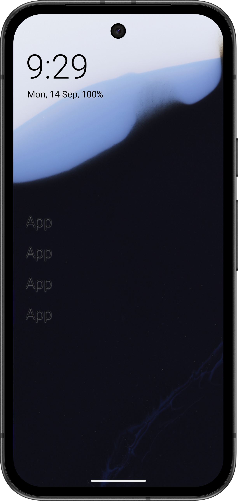
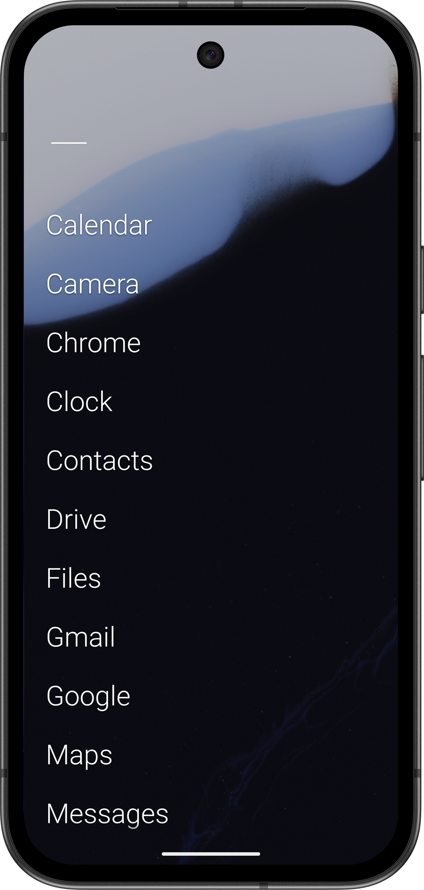
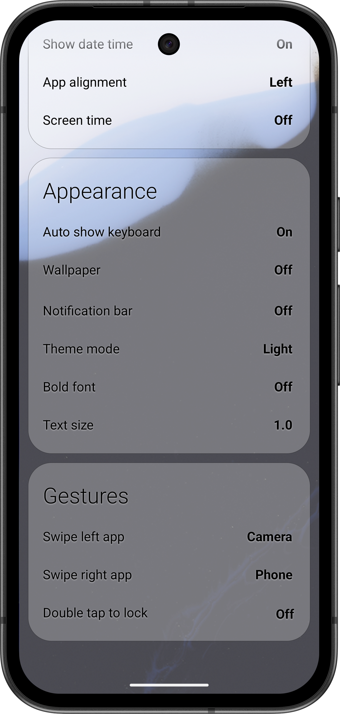

# MinLauncher

A minimal, ad-free, offline Android home screen launcher

MinLauncher is a fork of
[Olauncher](https://github.com/tanujnotes/Olauncher), with all promotional
content and network access removed.

## Get it

Download an APK from [F-Droid](https://f-droid.org/ja/packages/io.github.ouj4k2q5.minlauncher) or [GitHub Releases](https://github.com/ouj4k2q5/MinLauncher/releases).
To build from source or verify a release attestation, see the
[development guide](docs/development.md).

## Privacy

MinLauncher collects no analytics or telemetry and cannot access the network: it
does not declare the `INTERNET` permission. Its optional screen-time and
double-tap-to-lock features are processed entirely on the device. See
[Privacy](docs/privacy.md) for the permission-by-permission explanation.

## About this fork

This fork has its own name, application ID, and release versioning. It requires
Android 11 or later and removes upstream promotional, remote-wallpaper, and
legacy compatibility code. See [Changes from Olauncher](docs/fork-changes.md) for
the concise technical summary.

## Documentation

Technical and maintenance documentation is collected in [docs/](docs/README.md):

- [Development and building](docs/development.md)
- [Releasing](docs/releasing.md)
- [Privacy and permissions](docs/privacy.md)
- [Changes from Olauncher](docs/fork-changes.md)

## Contributing

This is a personal fork maintained for my own use, so feature requests are
unlikely to be accepted. Bug reports are welcome through
[Issues](https://github.com/ouj4k2q5/MinLauncher/issues).

Improvements that also apply to the original project are best contributed
[upstream](https://github.com/tanujnotes/Olauncher).

## License and credits

Licensed under [GNU GPL v3](LICENSE), the same license as Olauncher. The full
license text is in [`LICENSE`](LICENSE).
